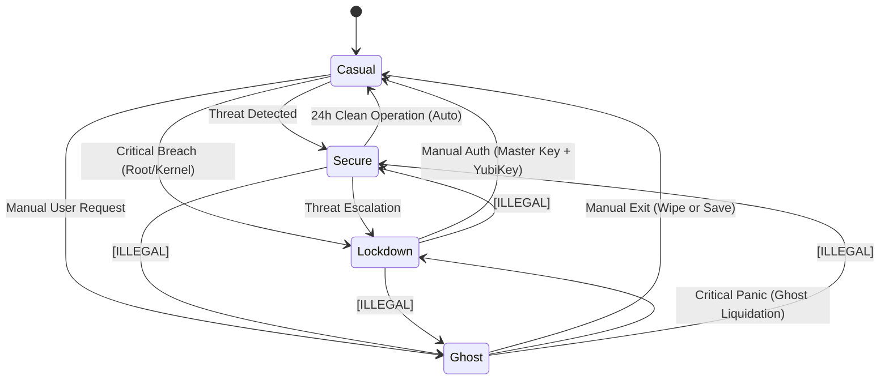

# Reaper-OS Mode State Machine (The Universe Layer)

This document defines the rigid state transitions for the Reaper-OS **Universe Layer**. It governs how the system shifts between its four "cosmic states" (Realities). These transitions are enforced by the Kernel (Voidborn) and the Paradigm daemon.

## 1. The Four Realities

1.  **Casual (State 1):** The default, permeable reality. User convenience is prioritized.
2.  **Secure (State 2):** Active defense reality. Triggered by threats. High monitoring, VPN mandated.
3.  **Lockdown (State 3):** The suffocated reality. Triggered by critical breaches. Total isolation.
4.  **Ghost (State 4):** The offensive reality. Ephemeral, non-persistent overlay for OpSec.

## 2. State Diagram

## 3. Legal Transitions

### A. The Defense Arc (Casual ↔ Secure)

#### 1. Casual → Secure
*   **Trigger:** Automated Threat Detection (Paradigm/Kernel).
*   **Conditions:** Malware signature, unverified process network activity, 5 failed login attempts.
*   **Authentication:** None (Automatic).
*   **Process State:** Suspicious processes frozen/quarantined. Standard processes persist but gain restrictions (e.g., forced VPN).
*   **Resources:** VPN tunnel initialized. Auditing level increased.
*   **Timing:** Instantaneous.

#### 2. Secure → Casual
*   **Trigger:** Automated Timer + System Integrity Check.
*   **Conditions:** 24 hours of operation with zero security incidents.
*   **Authentication:** None (Automatic), or Manual Override (User + Password).
*   **Process State:** Restrictions lifted. VPN optional.
*   **Resources:** High-frequency logging disabled.
*   **Timing:** Seamless.

### B. The Critical Arc (→ Lockdown)

#### 3. Secure → Lockdown
*   **Trigger:** Threat Escalation.
*   **Conditions:** Threat persists for >5 minutes, core daemon compromised, or multiple privilege escalation attempts.
*   **Authentication:** None (Automatic).
*   **Process State:** **Mass Extinction.** All non-whitelist processes killed. Network stack severed.
*   **Resources:** Filesystem remounted Read-Only. USB bus powered down.
*   **Timing:** Instantaneous (Aggressive).

#### 4. Casual → Lockdown (Direct Jump)
*   **Trigger:** Critical Breach.
*   **Conditions:** Rootkit detected, Kernel integrity failure, or Paradigm compromise.
*   **Authentication:** None (Automatic).
*   **Action:** Immediate transition to Lockdown, bypassing Secure mode.
*   **Timing:** Instantaneous.

#### 5. Lockdown → Casual
*   **Trigger:** Manual Recovery.
*   **Conditions:** Threat resolved/analyzed.
*   **Authentication:** **High.** Requires Physical Token (YubiKey) + Master Password.
*   **Process State:** System may require a reboot to ensure clean slate, otherwise daemons restarted.
*   **Resources:** Network unlocked. Filesystem R/W.
*   **Timing:** Graceful (30s countdown).

### C. The Ghost Arc (Casual ↔ Ghost)

#### 6. Casual → Ghost
*   **Trigger:** Manual User Request.
*   **Conditions:** System must be in **Casual** mode. (Cannot enter from Secure/Lockdown).
*   **Authentication:** User Password.
*   **Process State:** Host desktop suspended or backgrounded. Ghost container spun up.
*   **Resources:** `overlayfs` mounted at `/ghost`. Network namespace isolated (Tor).
*   **Timing:** ~2-5 seconds (Container spin-up).

#### 7. Ghost → Casual
*   **Trigger:** Manual User Exit.
*   **Conditions:** User chooses "Exit Ghost".
*   **Authentication:** None.
*   **Action:**
    1.  **Wipe:** RAM scrubbed, `/ghost` overlay discarded (or saved if requested).
    2.  **Restore:** Host desktop foregrounded.
*   **Timing:** Variable (depending on secure wipe duration).

#### 8. Ghost → Lockdown (The Emergency Eject)
*   **Trigger:** Critical Host Compromise detected *during* Ghost session.
*   **Action:** **Total Annihilation of Ghost.**
    *   Ghost container `kill -9`.
    *   Ghost memory pages zeroed immediately.
    *   Host enters Lockdown.
*   **Rationale:** We do not "save" the Ghost session. If the host is at risk, the offensive operation is burned to protect the hardware.

## 4. Illegal Transitions (The Laws)

| Source | Target | Status | Rationale |
| :--- | :--- | :--- | :--- |
| **Ghost** | **Secure** | **ILLEGAL** | **No Contamination.** If Ghost is compromised or host is attacked, we do not "downgrade" to defense. We terminate Ghost and lock down. |
| **Secure** | **Ghost** | **ILLEGAL** | **No Distraction.** You cannot launch offensive operations while under active attack. Resolve the threat first. |
| **Lockdown**| **Secure** | **ILLEGAL** | **No Half-Measures.** You cannot relax a critical breach state to a "warning" state. You must fully resolve it to Casual. |
| **Lockdown**| **Ghost** | **ILLEGAL** | **System Survival.** The system is in survival mode; spawning complex containers is forbidden. |

## 5. Transition Matrix Summary

| From \ To | Casual | Secure | Lockdown | Ghost |
| :--- | :---: | :---: | :---: | :---: |
| **Casual** | — | **Auto** (Threat) | **Auto** (Critical) | **Manual** (User) |
| **Secure** | **Auto** (24h Clean) | — | **Auto** (Escalation) | ⛔ **Illegal** |
| **Lockdown**| **Manual** (Auth) | ⛔ **Illegal** | — | ⛔ **Illegal** |
| **Ghost** | **Manual** (Exit) | ⛔ **Illegal** | **Auto** (Panic/Wipe) | — |

