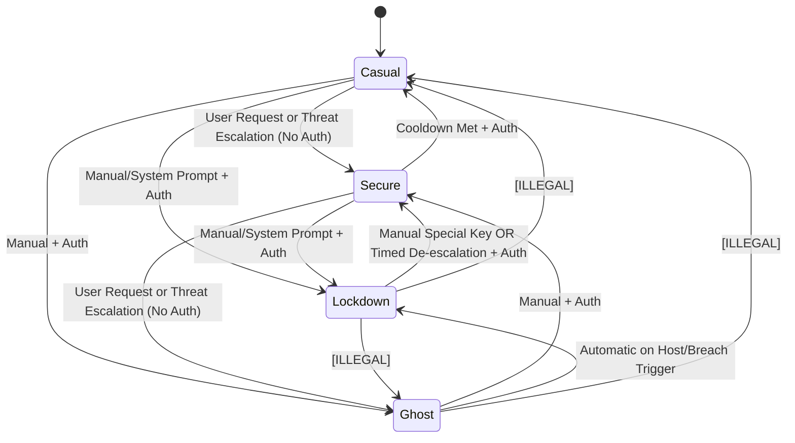

# Reaper-OS Mode State Machine (The Universe Layer)

This document defines the current transition contract for Reaper-OS user-facing modes. Transitions are enforced by the kernel transition envelope pipeline.

Canonical implementation freeze:
- `docs/components/modes/transition_contract_freeze.md`

## 1. Operational Modes

1. **Casual (State 1):** Daily operation mode.
2. **Secure (State 2):** Elevated defensive mode.
3. **Lockdown (State 3):** Emergency containment mode.
4. **Ghost (State 4):** Manual offensive/opsec mode.

`MODE_VOID` remains an internal bootstrap state and is not a user-operational mode.

## 2. State Diagram

## 3. Legal Transitions

### 1. Casual -> Secure
- Trigger: User request or detected threat escalation.
- Authentication: Not required.

### 2. Casual -> Lockdown
- Trigger: User request or system prompt due to critical conditions.
- Authentication: Required.
- Failure policy (system-prompt path): repeated auth failure leads to shutdown and next boot intent set to Lockdown.

### 3. Casual -> Ghost
- Trigger: Manual only.
- Authentication: Required.

### 4. Secure -> Casual
- Trigger: De-escalation.
- Conditions: Cooldown period satisfied.
- Authentication: Required.

### 5. Secure -> Lockdown
- Trigger: User request or system prompt under severe conditions.
- Authentication: Required.

### 6. Secure -> Ghost
- Trigger: User request or threat-driven escalation policy.
- Authentication: Not required (current draft policy).

### 7. Lockdown -> Secure
- Trigger: Manual or system-prompted de-escalation.
- Manual auth: Special de-escalation key.
- System-prompted auth: De-escalation period plus authentication.

### 8. Ghost -> Secure
- Trigger: Manual only.
- Authentication: Required.

### 9. Ghost -> Lockdown
- Trigger: Automatic when breach/host compromise threshold is crossed.
- Authentication: Not required.

## 4. Illegal Transitions

| Source | Target | Status |
| :--- | :--- | :--- |
| **Ghost** | **Casual** | **ILLEGAL** |
| **Lockdown** | **Casual** | **ILLEGAL** |
| **Lockdown** | **Ghost** | **ILLEGAL** |

## 5. Transition Matrix Summary

| From \ To | Casual | Secure | Lockdown | Ghost |
| :--- | :---: | :---: | :---: | :---: |
| **Casual** | — | **User/Auto**, No Auth | **User/System**, Auth | **Manual**, Auth |
| **Secure** | **Cooldown + Auth** | — | **User/System**, Auth | **User/Auto**, No Auth |
| **Lockdown** | ⛔ **Illegal** | **Manual/Auto De-escalation** | — | ⛔ **Illegal** |
| **Ghost** | ⛔ **Illegal** | **Manual**, Auth | **Auto** (Breach) | — |
